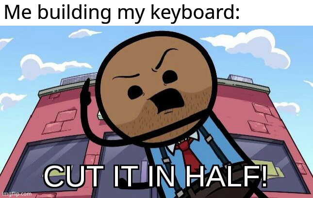
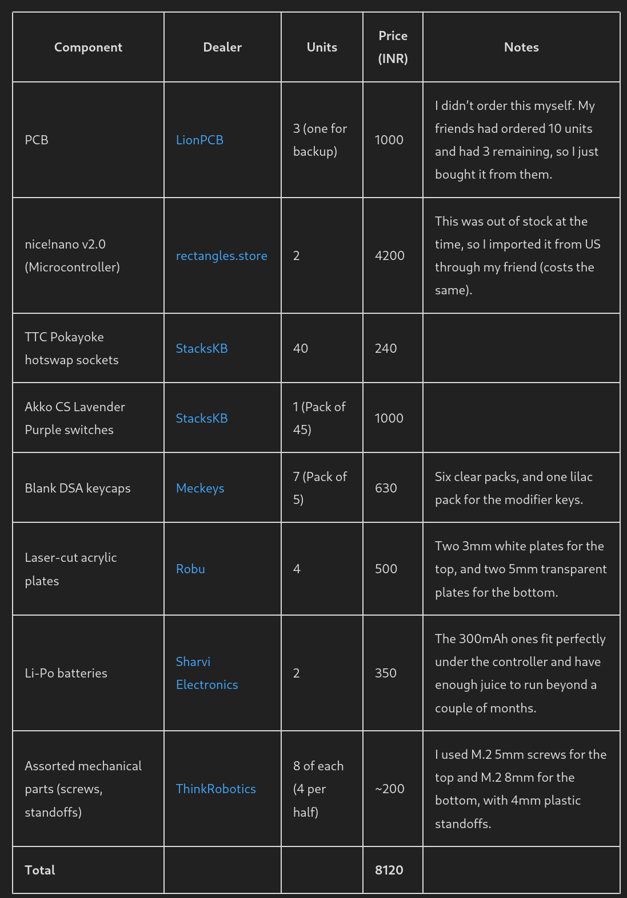
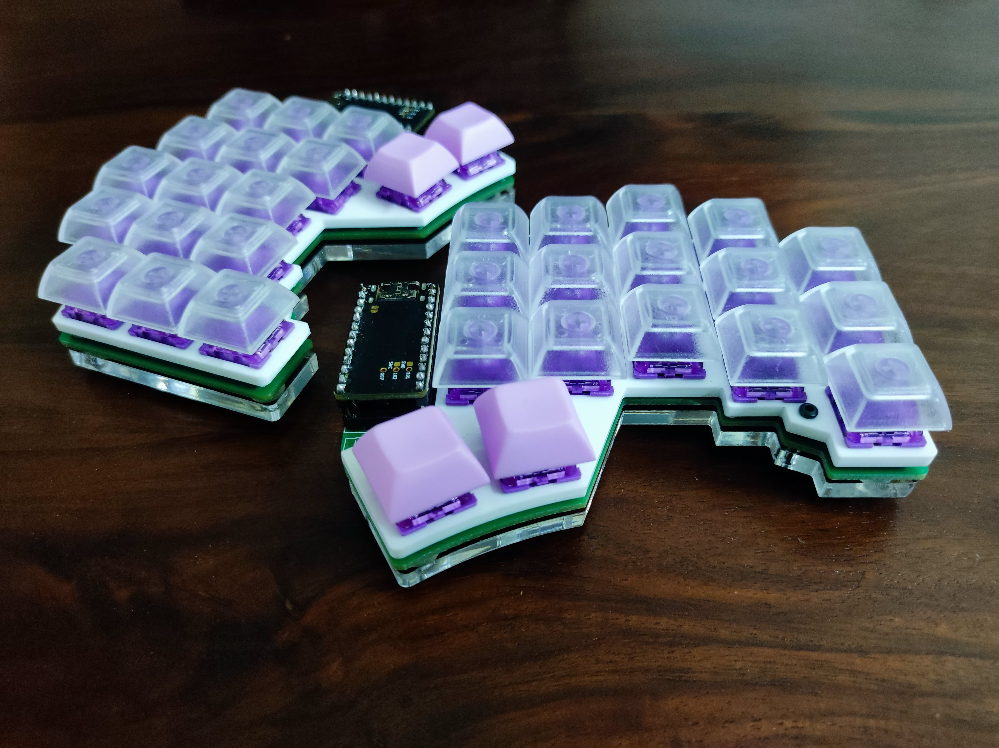
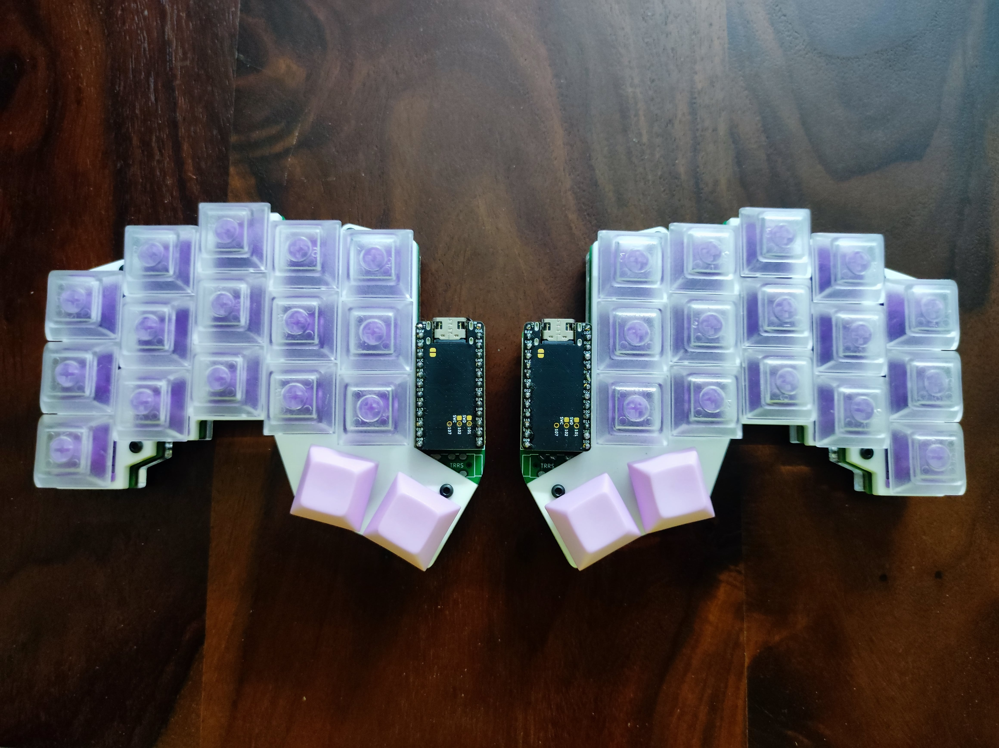
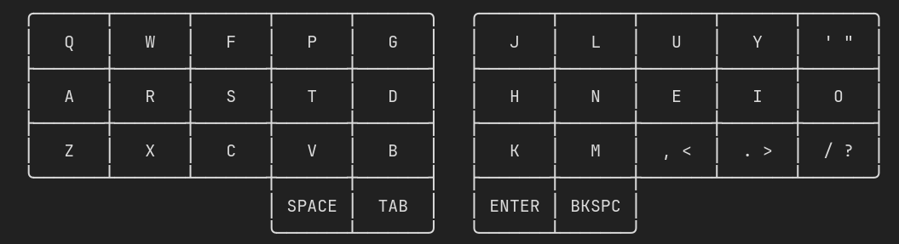
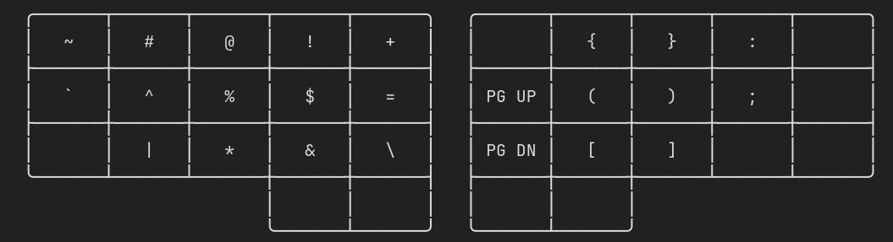
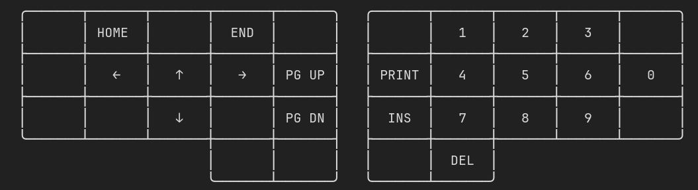
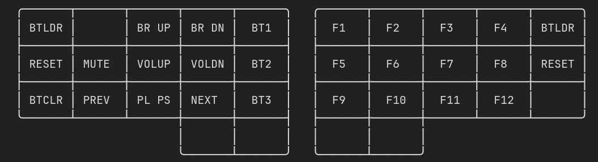
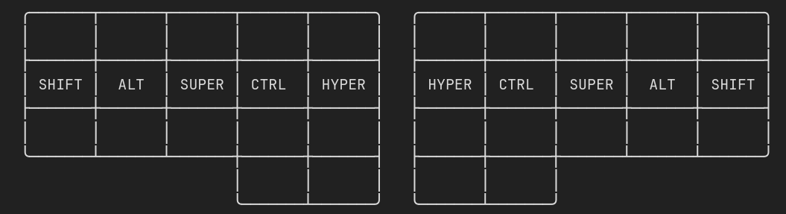
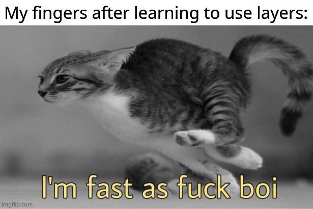

+++
date = 2023-04-06T18:32:35+05:30
title = "Ferricy: Building a custom 34-key split keyboard"
description = "Ergonomics, productivity, and style - all at once ;)"
tags = ['keyboards', 'random']
+++

Recently, I [wrote a blog](https://snprajwal.com/blog/keyboards-are-broken) explaining why I use Colemak. But I didn't stop there - I wanted to build the most ergonomic and mind-blowingly efficient keyboard out there. And it had to be *aesthetic*, because who wants to type on a janky piece of plastic all day?

# Who said there's just one piece

Ergonomic keyboards have been a thing for a while now. Most of them are gimmicks with the keys set at an angle and rotated to make it seem like you're not straining your wrists while using it. But there's one category of these that actually work - split keyboards.

The principle behind the design is very obvious:

- Normal keyboards cause ulnar deviation of your wrists. Split keyboards fix this by allowing you to position your wrists in a way where they rest at their natural angle. Each hand gets its own half of the keyboard!
- Some split keyboards are also ortholinear (The rows of keys are placed directly below one another, unlike the usual staggered arrangement), alleviating your fingers from curling along their length. You only need to move vertically from the home row to access the other rows.
- Most of the split keyboards have lesser keys than an ordinary one. Instead, they use layers or combos (more about this later) to provide all the symbols through fewer keys. This leads to lesser finger movement, improving ergonomics.

Naturally, I decided to build an ortholinear split keyboard.

  

While exploring my options, my buddies [Akshay](https://peppe.rs) and [Raghav](https://wscp.dev/about) introduced me to their 34-key split keyboard - the [Ferricy](https://github.com/icyphox/ferricy). It was love at first sight, and I set out to make one of my own!

# Sourcing the components

Building a keyboard from scratch is no small feat. It's expensive, and requires hunting for individual parts across a motley assortment of dealers. If you're unlucky, you might have to re-order some of them and pray that the second batch works. A quick TLDR of how keyboards work - you have **keycaps** attached to **switches**, which are socketed into a **Printed Circuit Board (PCB)**. The PCB has a **controller**, which deciphers which key was pressed, and generates the appropriate keycode. This entire rig is covered with a bunch of plastic, or sandwiched between acrylic plates. Quite simple, really.

Here's a list of the components I used, along with the dealer and prices:

  

Damn. Half of the total cost was just the wireless controllers. If you want a wired build instead, a pair of Arduino ProMicros will run you out maybe 800 bucks each. Bluetooth is costly :/

# Putting it all together

The assembly was the easiest part. Solder the sockets onto the PCB, pop the controller and switches in, attach the keycaps. Raghav helped me with deciphering the hieroglyphs on the PCB and solder everything correctly (hardware n00b here, plis forgib me). We ended up having some trouble with a buggy PCB, and in the end just moved everything to the spare PCB. Mount the acrylic plates, and it's ready! Oh, what a beauty :')

  

  

# Reveal thy layers!

In order to actually use the keyboard, you need to flash it with a firmware. Since mine was wireless, I went with [ZMK](https://zmk.dev), which is developed with first-class support for Bluetooth keyboards.

I use Colemak for the base layout, with a small modification - I replaced the semicolon with the apostrophe, since that is a lot more common in ordinary typing. The bottom four keys are `Space`, `Tab`, `Return` (`Enter`), and `Backspace`.

  

Holding down `Backspace` (on the right half) activates the symbol pad on the left, and parentheses pad on the right, along with the strategically placed semicolon and colon.

  

Holding down `Space` (on the left half) activates the navigation pad on the left, and the number pad on the right. It also enables `Backspace` to act as `Delete`.

  

Holding down `Tab` (on the left half) activates the utility pad on the left (volume, media playback, and the keyboard's bluetooth connection controls), and the function pad on the right.

  

Holding down `Enter` (on the right half) enables it to act as `Right Alt`, which is usually mapped to the ISO Level 3 modifier and used to enter special characters like á or é. ¿Cómo estás hombre?

As for the modifier keys, they sit right on the home row. Each key acts as a normal character key when pressed quickly, and behaves like a modifier when pressed and held. I also have the luxury of enabling the `Hyper`, which is a shortcut for `Shift` + `Ctrl` + `Alt` + `Super` (You might identify `Super` as the Windows key if you are not familiar with Linux).

  

Finally, there are some characters like hypen and underscore that don't really belong in any of the above layers. You might also have noticed that there is no `Escape` key anywhere. That's because it's way too important to go on a layer, and there are no keys remaining on the base layer. So how do I access these keys? ZMK provides a feature called combos, where a combination of keys can be pressed together to generate a completely different keycode. Here's how I set them up:

- `T` and `N` create `Escape`.
- `S` and `I` create `-` (hyphen).
- `R` and `I` create `_` (underscore).
- `A` and `O` activate a nifty feature called `Caps Word`, which is like `Caps Lock` but for just one word (it's active until you hit `Space` or `Tab`).

# My head's spinning, captain

Phew. That is a ***lot*** of bindings to remember! But once it gets ingrained into your muscle memory, you would be aghast at how efficient it is. It took around four hours for me to reach 80% of my original speed (I used to average 120wpm). In two days I was considerably faster, and using far less effort to type. While layers are an added cognitive burden, they more than make up for it by axing the mechanical burden for your fingers. Now, I'm Blazingly Fast™ like a true Rustacean :P

  

# The takeaway

This was a personal quest to do something new, and improve my computer workflow in the process. I'm glad it worked out for me, but I wouldn't recommend it unless you're really really passionate about split keyboards and are willing to burn a significant amount of cash and time in building it. But if you do take the leap of faith and build one, I would love to see it! Feel free to send it over, you can find my socials on the home page :)
