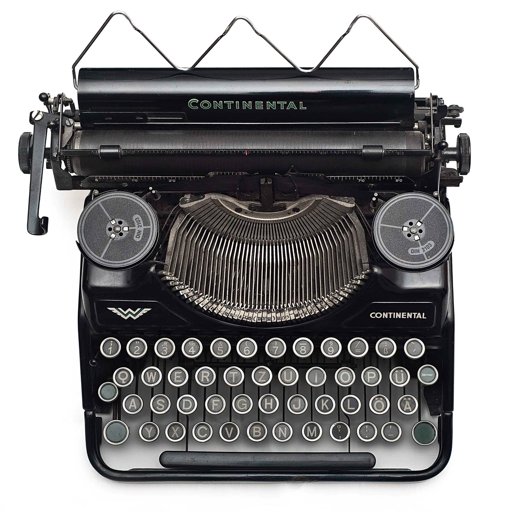

+++
date = 2022-11-03T22:48:30+05:30
title = 'Your keyboard layout is broken'
description = 'Why QWERTY is a really bad idea'
tags = ['keyboards', 'random']
+++

If you're like most people, you have a very normal, ordinary keyboard. Nothing fancy. Or maybe you have a mildly abnormal, slightly fancier, and hella lot more expensive keyboard (Hello, [r/MechanicalKeyboards](https://reddit.com/r/mechanicalkeyboards)).

  <figure>
    
    <figcaption style="font-style:italic;font-size:80%;">
      Source: <a href="https://www.reddit.com/r/pcmasterrace/comments/h9phu4/clic_clac/">r/pcmasterrace</a>
    </figcaption>
  </figure>

Either way, all of them follow the same fundamental design - there are multiple rows of keys, with each successive row staggered towards the right, and one of these rows starts with the very familiar QWERTY sequence that makes you wonder what kind of drugs the designer was high on while arranging the letters. But have you ever questioned *why* your keyboard is the way it is?

# Klaka-klaka-klaka-ching!

The first Remington typewriter was produced on March 1, 1873. It introduced the QWERTY keyboard to the world, and was a raging success, setting a precedent for every single typewriter that followed. If you take a look at an image of a conventional typewriter, the reason for one of the oddities becomes fairly obvious:

  

Every key is connected to an arm, which in turn acts as a lever and raises the typebar for the respective character. Naturally, these arms cannot overlap, which led to every row being slightly offset against the one above it.

# Let's play some very drunk Scrabble

Now that you know (to some extent) how a typewriter operates, we can proceed to understanding the marvellous arrangement of keys you see on every device out there. The [QWERTY](https://en.wikipedia.org/wiki/QWERTY) layout was invented by [Christopher Latham Sholes](https://en.wikipedia.org/wiki/Christopher_Latham_Sholes) in the early 1870s, and was refined across the next eight years into what we use today. The main objective of this layout was to place consecutively used letters far apart, in order to prevent the typebars from getting jammed. It also used suggestions from telegraph operators to make the letter placement reasonable to use. With the release of the Remington No. 2, QWERTY cemented itself as the de facto keyboard layout. When computer manufacturers began producing digital keyboards, they just went along with what was the norm and adapted the same layout. Quite unfortunate, since August Dvorak came up with the significantly better [DVORAK](https://en.wikipedia.org/wiki/Dvorak_keyboard_layout) layout in 1932, which prevented jamming while also being far more ergonomic. _sed_ :/

# The future is now, old man

QWERTY was designed to solve a very specific set of problems, and it's good enough at that. The issue is that today, it's being used as a solution for these problems which doesn't exist anymore. Modern keyboards don't use jammable arms, they use a matrix of switches that send a high or low voltage signal when pressed. Staggered rows and separated bigrams don't serve any purpose other than making shoulder and wrist health a living hell for most users. Here's a few reasons why most keyboards suck:

- Your hand sits on the home row by default, and hits an astonishingly small percentage of keys [(37%)](https://www.keybr.com/layouts). *Home row*? More like *home no*.
- There is ulnar deviation at your wrists (bending them outwards) because you bring your arms towards the center of your body but angle your hands forwards instead of inwards. This is responsible for the notoriously common [Repetitive Strain Injury (RSI)](https://en.wikipedia.org/wiki/Repetitive_strain_injury), and is in fact common enough for Wikipedia to use a keyboard as the official image for this condition.
- Your fingers curl along their length, which means they deviate from their resting angle each time you jump to a different row. The staggered rows ensure that your fingers never remain in their natural state for more than a couple of keystrokes.

Fortunately, there exist solutions to all of these problems:

- The [Colemak](https://colemak.com) layout was designed with the capabilities of modern keyboards in mind. It is far more sensible than both QWERTY and Dvorak, and achieves an amazing 74% home row keystrokes. There also exists the [Workman](https://workmanlayout.org) layout, which aims to reduce lateral movement of the hand, but is less efficient compared to Colemak.
- An ergonomic keyboard that is split into two individual units allows you to place your arms comfortably across the table at their natural angle, and saves your wrists from certain death.
- An ortholinear keyboard (all rows aligned vertically) fixes the finger deviation issue.

How many of these solutions do I use, you ask? I switched to Colemak when I noticed shoulder and wrist pain from long hours of typing. As for the remaining two points, keep an eye out for future posts ;)
