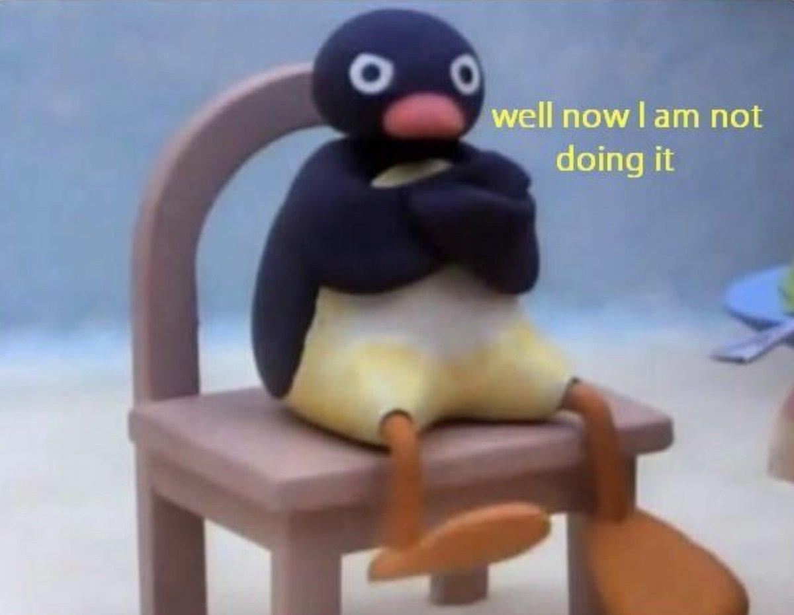

+++
date = 2022-11-30T21:29:41+05:30
title = "The perfectionism paradox"
description = "Why you need to relinquish your desire for flawlessness"
tags = ['philosophy', 'self-help']
+++

You're probably already thinking "No one is perfect", "We all make mistakes", or if you're a little more poetic, "Beauty lies in imperfection". *&ast;insert confetti and sprinkles&ast;*

And you're perfectly (heh) right - all three of them hold good in the real world. But despite knowing this, we desire to be perfect; to never make mistakes; to be flawlessly beautiful. What makes us hold on to these quixotic ideals, and how are they affecting our experience of life?

# I ain't doin it

Picture this - you've just been given the opportunity to do something you've never done before. You have a brief idea of the what and the how, but you lack the specifics since it's your first time (or if you're a wiki-explorer like me, you might even know the entire thing theoretically from head to toe). What do you think you'll do?

  

If you're a perfectionist, you're most likely going to bail. Or you may take it on, and find all sorts of excuses to not carry it to completion. The point is that your fear of producing a result that is not one hundred percent ideal overrides your decision-making process. If you're not going to do it perfectly the first time, you'd much rather not do it at all. Why should you settle for a mediocre attempt when you're clearly capable of doing an exemplary job? Time to introduce you to the paradox.

# What kind of sorcery is this

Different activities have different learning curves. There are some things that you can become more or less perfect at in a couple of tries, like hammering a nail in or folding a paper airplane. There are some other things that you'll never be perfect at, even if you practise across multiple lifetimes, like music or painting. Either way, it's quite obvious that if you want to get good at something, you need to do it multiple times. Yes, you'll be absolute garbage the first time, but that's part of the process. This creates what I like to call the **perfectionism paradox**:

- To do a thing perfectly, you need to do it repeatedly.
- To do a thing repeatedly, you need to be willing to not do it perfectly.

And just like that, the fabric of reality begins to collapse, unable to process the infinite cycle between repetition and perfection. You cope with this in a variety of different ways:

- ***Accusation***: The universe plotted against you and prevented you from doing it.
- ***Denial***: It takes a genius to figure out how to do it, or it's so simple that it's beneath you.
- ***Procrastination***: It might be better if you do it tomorrow ... and that tomorrow never comes :)
- ***Burnout***: You push yourself but fail to meet your delusional standards, and lose all sense of self-worth along the way.

# Let it go, let it go

**Elsa**: Let it go, let it go, that perfect girl is gone!\
**You**: Sounds good, I should try that too. Maybe I'll do it tomorrow...

No. Take a leaf out of her book and do it now. There is no perfection; only excellence. By aligning your goals towards the latter, you allow yourself to grow in what you do. An honest first attempt counts as an excellent attempt. An honest hundredth attempt counts as an equally excellent attempt, provided the outcome isn't identical to the first. Unlike the abstract notion of perfection, excellence provides a tangible yardstick to measure your progress against.

The first time you give this a shot, it's going to be really, really hard. Almost impossible. But if you can grit your teeth and power through it, you realise that it gets easier with each try. You also discover that you don't perish in self-inflicted anxiety anymore. You'll continue to face issues and setbacks, but at least you're not the source! Now that you're not worried about an ideal outcome, you can enjoy the process and revel in your final result, irrespective of how imperfect it may be. As long you're having fun, who cares?
